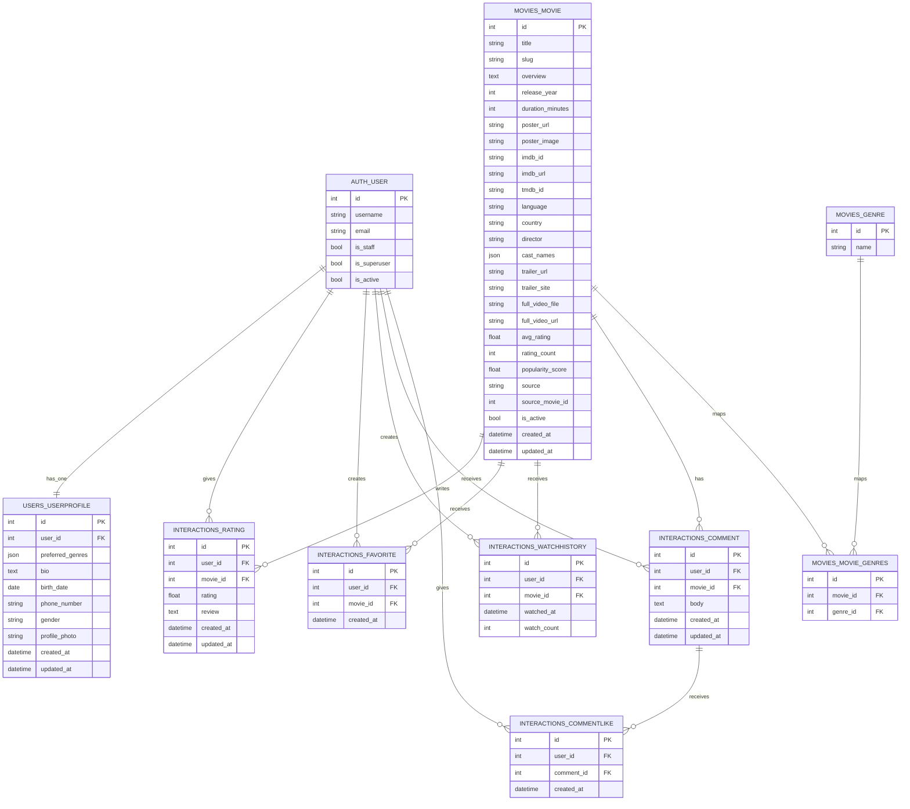

# 05. Database schema va ER diagram

## 5.1. DB modeli haqida

Loyihada alohida custom user modeli ishlatilmagan. Shu sababli authentication uchun Django'ning standart `auth_user` jadvali ishlaydi.

Asosiy biznes jadvallar:

- `movies_genre`
- `movies_movie`
- `movies_movie_genres` (many-to-many join table)
- `users_userprofile`
- `interactions_rating`
- `interactions_favorite`
- `interactions_watchhistory`
- `interactions_comment`
- `interactions_commentlike`

`apps/recommendations/models.py` hozircha bo'sh, chunki recommendation engine asosan runtime dataframe va cache orqali ishlaydi.

## 5.2. Jadval vazifalari

### `auth_user`

Django built-in user jadvali. Login, username, email, is_staff, is_superuser kabi maydonlarni saqlaydi.

### `users_userprofile`

User profiliga tegishli qo'shimcha maydonlar:

- preferred_genres
- bio
- birth_date
- phone_number
- gender
- profile_photo

### `movies_genre`

Janr nomlarini saqlaydi.

### `movies_movie`

Asosiy movie jadvali. Title, slug, overview, release_year, duration, poster URL, lokal poster fayli, TMDB/IMDb ID va aggregate metrikalarni saqlaydi.

Muhim poster maydonlari:

- `poster_url` — TMDB yoki tashqi image URL
- `poster_image` — lokal media storage'ga yuklab olingan poster fayli

### `interactions_rating`

User → movie rating va review.

### `interactions_favorite`

User favorite qilgan filmlar.

### `interactions_watchhistory`

Foydalanuvchi detail page ochganda yoki movie bilan ishlaganda watch history signal.

### `interactions_comment`

Movie detail sahifasidagi comment matni.

### `interactions_commentlike`

Comment'ga bosilgan like'lar.

## 5.3. ER diagram (Mermaid)

## 5.4. Relationship izohlari

- bir user'da bitta profile bo'ladi;
- bir user ko'p rating, favorite, watch history, comment va comment like yozishi mumkin;
- bir movie ko'p rating, favorite, watch history va comment qabul qiladi;
- movie va genre o'rtasida many-to-many bog'lanish bor;
- comment like alohida jadval orqali saqlanadi;
- rating, favorite, watch history uchun `(user, movie)` unique cheklovlari mavjud.

## 5.5. Poster cache DB nuqtai nazaridan qanday ishlaydi?

Poster cache tizimi ikkita darajali modeldan foydalanadi:

1. `poster_url` — tashqi manbaga ishora qiluvchi URL.
2. `poster_image` — lokal yuklab olingan poster fayli.

Frontend `poster_src` property orqali poster manbasini tanlaydi:

- avval `poster_image` tekshiriladi;
- u bo'lmasa `poster_url` ishlatiladi.

Bu yondashuv fallback xavfsizligini saqlaydi va posterlarni bosqichma-bosqich lokal storage'ga o'tkazishga imkon beradi.

## 5.6. Recommendation DB nega alohida jadvalga yozmaydi?

Bu loyiha tavsiyalarni oldindan persist qilish o'rniga, runtime vaqtida hisoblaydi. Buning sabablari:

- modelni tez almashtirish mumkin;
- user signal yangilanganda tavsiya ham darhol yangilanadi;
- experimental architecture uchun qulay;
- explainability payload'ni real vaqtga yaqin shakllantirish mumkin.
