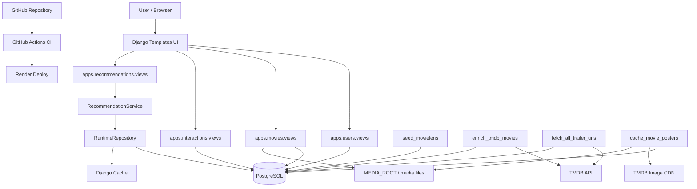
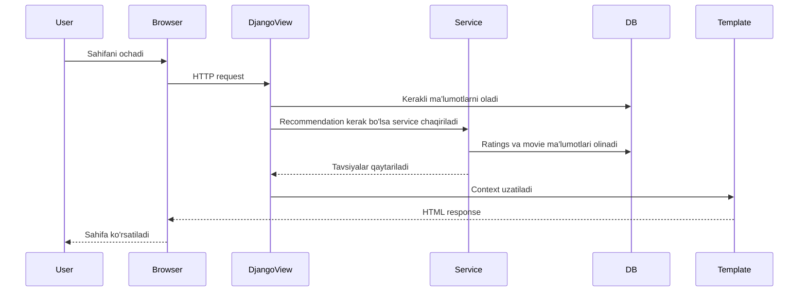
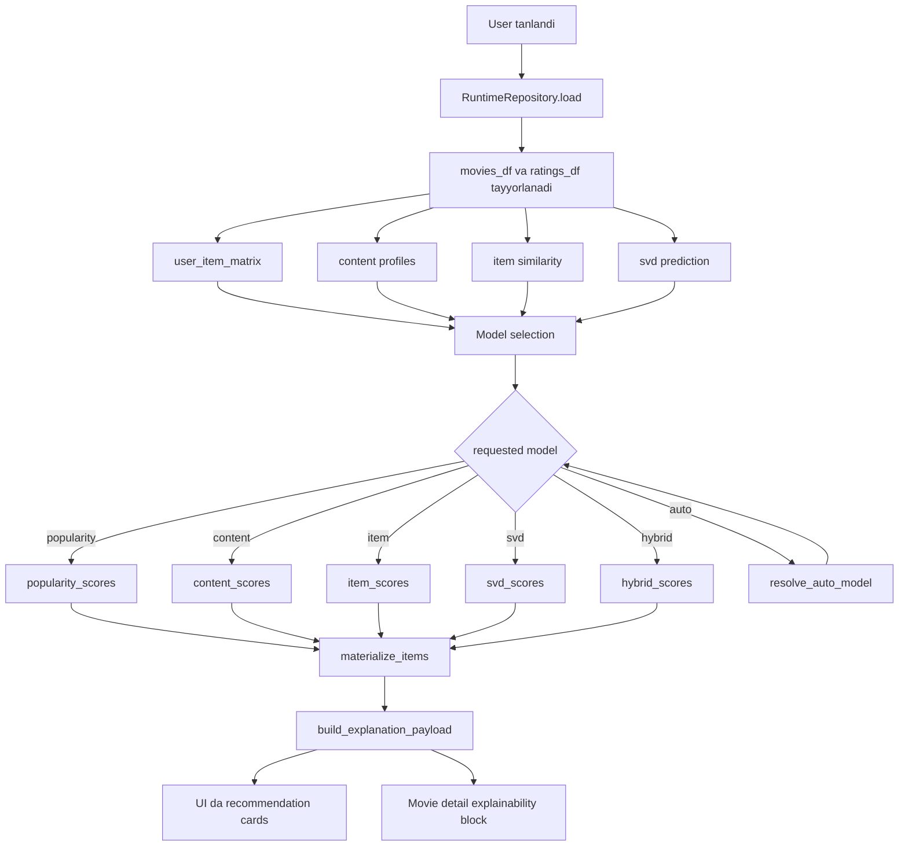
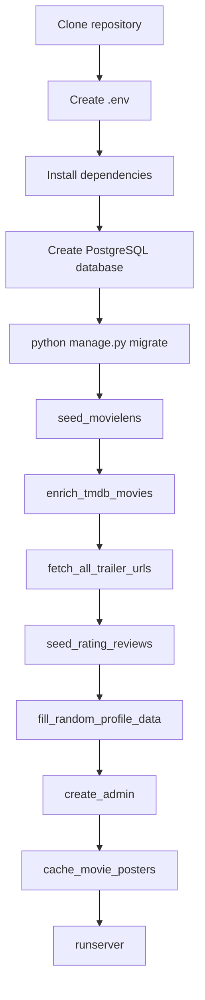
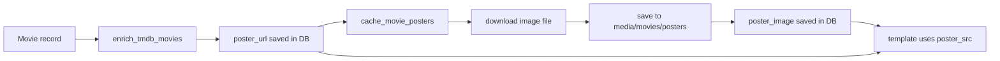

# 07. Arxitektura va flow diagrammalari

## 7.1. System architecture

## 7.2. HTTP request flow

## 7.3. Recommendation pipeline

## 7.4. Data bootstrap flow

## 7.5. Poster pipeline flow

## 7.6. Deploy / CI flow

```mermaid
flowchart LR
    A[Developer pushes code to GitHub] --> B[.github/workflows/ci.yml]
    B --> C[Install dependencies]
    C --> D[manage.py check]
    D --> E[makemigrations --check --dry-run]
    E --> F[migrate]
    F --> G[collectstatic]
    G --> H[CI success]
    H --> I[Render build.sh]
    I --> J[pip install -r requirements/prod.txt]
    J --> K[collectstatic]
    K --> L[migrate]
    L --> M[gunicorn config.wsgi:application]
```

## 7.7. Nega shu arxitektura tanlangan?

- Django Templates kichik va o'rta hajmdagi BMI loyihasi uchun sodda va tez integratsiya qiladi.
- PostgreSQL relational interaction datasi uchun mos.
- Recommendation engine'ni app ichida alohida modulga ajratish maintainability beradi.
- TMDB API movie metadata va trailer/poster kabi boyituvchi ma'lumotlarni beradi.
- Poster cache qatlamı tashqi image host'ga bog'liqlikni kamaytiradi.
- GitHub Actions va Render bilan deploy pipeline soddalashtirilgan.
